### Using machine learning approach to predict `BodyTemp`

##Set up Libraries

::: cell
``` {.r .cell-code}
library(tidyverse)
```

::: {.cell-output .cell-output-stderr}
```         
── Attaching packages ─────────────────────────────────────── tidyverse 1.3.2 ──
✔ ggplot2 3.4.1     ✔ purrr   1.0.1
✔ tibble  3.1.8     ✔ dplyr   1.1.0
✔ tidyr   1.3.0     ✔ stringr 1.5.0
✔ readr   2.1.3     ✔ forcats 1.0.0
── Conflicts ────────────────────────────────────────── tidyverse_conflicts() ──
✖ dplyr::filter() masks stats::filter()
✖ dplyr::lag()    masks stats::lag()
```
:::

``` {.r .cell-code}
library(here)
```

::: {.cell-output .cell-output-stderr}
```         
here() starts at C:/Users/weifa/OneDrive/Documents/GitKraken/MADA/data analysis/Weifan-MADA-portfolio
```
:::

``` {.r .cell-code}
library(skimr)
library(tidymodels)
```

::: {.cell-output .cell-output-stderr}
```         
── Attaching packages ────────────────────────────────────── tidymodels 1.0.0 ──
✔ broom        1.0.3     ✔ rsample      1.1.1
✔ dials        1.1.0     ✔ tune         1.0.1
✔ infer        1.0.4     ✔ workflows    1.1.2
✔ modeldata    1.1.0     ✔ workflowsets 1.0.0
✔ parsnip      1.0.3     ✔ yardstick    1.1.0
✔ recipes      1.0.4     
── Conflicts ───────────────────────────────────────── tidymodels_conflicts() ──
✖ scales::discard() masks purrr::discard()
✖ dplyr::filter()   masks stats::filter()
✖ recipes::fixed()  masks stringr::fixed()
✖ dplyr::lag()      masks stats::lag()
✖ yardstick::spec() masks readr::spec()
✖ recipes::step()   masks stats::step()
• Dig deeper into tidy modeling with R at https://www.tmwr.org
```
:::

``` {.r .cell-code}
library(rpart)
```

::: {.cell-output .cell-output-stderr}
```         

Attaching package: 'rpart'

The following object is masked from 'package:dials':

    prune
```
:::

``` {.r .cell-code}
library(glmnet)
```

::: {.cell-output .cell-output-stderr}
```         
Loading required package: Matrix

Attaching package: 'Matrix'

The following objects are masked from 'package:tidyr':

    expand, pack, unpack

Loaded glmnet 4.1-6
```
:::

``` {.r .cell-code}
library(ranger)
library(vip)
```

::: {.cell-output .cell-output-stderr}
```         
Warning: package 'vip' was built under R version 4.2.3
```
:::

::: {.cell-output .cell-output-stderr}
```         

Attaching package: 'vip'

The following object is masked from 'package:utils':

    vi
```
:::

``` {.r .cell-code}
library(rpart.plot)
```

::: {.cell-output .cell-output-stderr}
```         
Warning: package 'rpart.plot' was built under R version 4.2.3
```
:::

``` {.r .cell-code}
library(knitr)
```
:::

## Load data

::: cell
``` {.r .cell-code}
data_location=here::here("fluanalysis","data","processed_data.rds")
exp_data=readRDS(file=data_location)
```
:::

## Data Setup

::: cell
``` {.r .cell-code}
set.seed(123)
# data splitting
bodytemp_split=initial_split(exp_data,prop=0.7,strata = BodyTemp)
bodytemp_train=training(bodytemp_split)
bodytemp_test=testing(bodytemp_split)
# data re-sampling using cross-validation
bodytemp_folds=vfold_cv(bodytemp_train,v=5,repeats = 5,strata = BodyTemp)
# Create a recipe
bodytemp_rec=recipe(BodyTemp~.,data=bodytemp_train)%>%
  step_dummy(all_nominal(),-Weakness,-CoughIntensity,-Myalgia)%>%
  step_mutate(Weakness = factor(Weakness, levels = c("None","Mild","Moderate","Severe"), ordered = TRUE),
              CoughIntensity= factor(CoughIntensity, levels = c("None","Mild","Moderate","Severe"), ordered = TRUE),
              Myalgia=factor(Myalgia, levels = c("None","Mild","Moderate","Severe"), ordered = TRUE)) %>%
  step_ordinalscore(Weakness, CoughIntensity, Myalgia)%>%
  step_nzv(all_predictors(),unique_cut = 50)
```
:::

## Creating workflow without models

::: cell
``` {.r .cell-code}
bodytemp_wf=workflow()%>%
  add_recipe(bodytemp_rec)
```
:::

## Null model performance

::: cell
``` {.r .cell-code}
null_regression <- null_model() %>%
  set_engine("parsnip") %>%
  set_mode("regression")

null_rs <- fit_resamples(
 bodytemp_wf %>% add_model(null_regression),
  bodytemp_folds,
  metrics = metric_set(rmse),
 control=control_resamples(save_pred = TRUE)
)

null_rs%>%
  collect_metrics()
```

::: {.cell-output .cell-output-stdout}
```         
# A tibble: 1 × 6
  .metric .estimator  mean     n std_err .config             
  <chr>   <chr>      <dbl> <int>   <dbl> <chr>               
1 rmse    standard    1.21    25  0.0177 Preprocessor1_Model1
```
:::
:::

## Model specification for three models

::: cell
``` {.r .cell-code}
# Decision Tree
tree_spec=decision_tree(
  cost_complexity = tune(),
  tree_depth=tune()
  )%>%
  set_engine("rpart")%>%
  set_mode("regression")
# LASSO
glm_spec=linear_reg(penalty=tune(),mixture=1)%>%
  set_engine("glmnet")

# Random forest
cores <- parallel::detectCores()
rf_spec=
  rand_forest(mtry=tune(),min_n=tune(),trees=1000)%>%
  set_engine("ranger",num.threads=cores)%>%
  set_mode("regression")
```
:::

## Creating workflow for each model

::: cell
``` {.r .cell-code}
# Decision Tree
tree_wf=bodytemp_wf%>%
  add_model(tree_spec)
# LASSO
glm_wf=bodytemp_wf%>%
  add_model(glm_spec)
# Random forest
rf_wf=bodytemp_wf%>%
  add_model(rf_spec)
```
:::

## Creating regular grid of values for each hyperparameters in three models

::: cell
``` {.r .cell-code}
# Decision Tree
tree_grid=grid_regular(cost_complexity(),
                       tree_depth(),
                       levels=5)
tree_grid
```

::: {.cell-output .cell-output-stdout}
```         
# A tibble: 25 × 2
   cost_complexity tree_depth
             <dbl>      <int>
 1    0.0000000001          1
 2    0.0000000178          1
 3    0.00000316            1
 4    0.000562              1
 5    0.1                   1
 6    0.0000000001          4
 7    0.0000000178          4
 8    0.00000316            4
 9    0.000562              4
10    0.1                   4
# … with 15 more rows
```
:::

``` {.r .cell-code}
# LASSO
glm_grid=tibble(penalty=10^seq(-4,-1,length.out=30))
glm_grid%>%
  top_n(-5)
```

::: {.cell-output .cell-output-stderr}
```         
Selecting by penalty
```
:::

::: {.cell-output .cell-output-stdout}
```         
# A tibble: 5 × 1
   penalty
     <dbl>
1 0.0001  
2 0.000127
3 0.000161
4 0.000204
5 0.000259
```
:::

``` {.r .cell-code}
glm_grid%>%
  top_n(5)
```

::: {.cell-output .cell-output-stderr}
```         
Selecting by penalty
```
:::

::: {.cell-output .cell-output-stdout}
```         
# A tibble: 5 × 1
  penalty
    <dbl>
1  0.0386
2  0.0489
3  0.0621
4  0.0788
5  0.1   
```
:::

``` {.r .cell-code}
# Random forest
# using a space-filling design to tune later
```
:::

## Train and tune the models

::: cell
``` {.r .cell-code}
# Decision Tree
tree_rs=tree_wf%>%
  tune_grid(
    resamples=bodytemp_folds,
    grid=tree_grid
  )
```

::: {.cell-output .cell-output-stderr}
```         
! Fold1, Repeat1: internal:
  There was 1 warning in `dplyr::summarise()`.
  ℹ In argument: `.estimate = metric_fn(truth = BodyTemp, estimate = .pr...
    = na_rm)`.
  ℹ In group 1: `cost_complexity = 0.1`, `tree_depth = 1`.
  Caused by warning:
  ! A correlation computation is required, but `estimate` is constant an...
  ℹ In argument: `.estimate = metric_fn(truth = BodyTemp, estimate = .pr...
    = na_rm)`.
  ℹ In group 1: `cost_complexity = 0.1`, `tree_depth = 4`.
  Caused by warning:
  ! A correlation computation is required, but `estimate` is constant an...
  ℹ In argument: `.estimate = metric_fn(truth = BodyTemp, estimate = .pr...
    = na_rm)`.
  ℹ In group 1: `cost_complexity = 0.1`, `tree_depth = 8`.
  Caused by warning:
  ! A correlation computation is required, but `estimate` is constant an...
  ℹ In argument: `.estimate = metric_fn(truth = BodyTemp, estimate = .pr...
    = na_rm)`.
  ℹ In group 1: `cost_complexity = 0.1`, `tree_depth = 11`.
  Caused by warning:
  ! A correlation computation is required, but `estimate` is constant an...
  ℹ In argument: `.estimate = metric_fn(truth = BodyTemp, estimate = .pr...
    = na_rm)`.
  ℹ In group 1: `cost_complexity = 0.1`, `tree_depth = 15`.
  Caused by warning:
  ! A correlation computation is required, but `estimate` is constant an...
```
:::

::: {.cell-output .cell-output-stderr}
```         
! Fold2, Repeat1: internal:
  There was 1 warning in `dplyr::summarise()`.
  ℹ In argument: `.estimate = metric_fn(truth = BodyTemp, estimate = .pr...
    = na_rm)`.
  ℹ In group 1: `cost_complexity = 0.1`, `tree_depth = 1`.
  Caused by warning:
  ! A correlation computation is required, but `estimate` is constant an...
  ℹ In argument: `.estimate = metric_fn(truth = BodyTemp, estimate = .pr...
    = na_rm)`.
  ℹ In group 1: `cost_complexity = 0.1`, `tree_depth = 4`.
  Caused by warning:
  ! A correlation computation is required, but `estimate` is constant an...
  ℹ In argument: `.estimate = metric_fn(truth = BodyTemp, estimate = .pr...
    = na_rm)`.
  ℹ In group 1: `cost_complexity = 0.1`, `tree_depth = 8`.
  Caused by warning:
  ! A correlation computation is required, but `estimate` is constant an...
  ℹ In argument: `.estimate = metric_fn(truth = BodyTemp, estimate = .pr...
    = na_rm)`.
  ℹ In group 1: `cost_complexity = 0.1`, `tree_depth = 11`.
  Caused by warning:
  ! A correlation computation is required, but `estimate` is constant an...
  ℹ In argument: `.estimate = metric_fn(truth = BodyTemp, estimate = .pr...
    = na_rm)`.
  ℹ In group 1: `cost_complexity = 0.1`, `tree_depth = 15`.
  Caused by warning:
  ! A correlation computation is required, but `estimate` is constant an...
```
:::

::: {.cell-output .cell-output-stderr}
```         
! Fold3, Repeat1: internal:
  There was 1 warning in `dplyr::summarise()`.
  ℹ In argument: `.estimate = metric_fn(truth = BodyTemp, estimate = .pr...
    = na_rm)`.
  ℹ In group 1: `cost_complexity = 0.1`, `tree_depth = 1`.
  Caused by warning:
  ! A correlation computation is required, but `estimate` is constant an...
  ℹ In argument: `.estimate = metric_fn(truth = BodyTemp, estimate = .pr...
    = na_rm)`.
  ℹ In group 1: `cost_complexity = 0.1`, `tree_depth = 4`.
  Caused by warning:
  ! A correlation computation is required, but `estimate` is constant an...
  ℹ In argument: `.estimate = metric_fn(truth = BodyTemp, estimate = .pr...
    = na_rm)`.
  ℹ In group 1: `cost_complexity = 0.1`, `tree_depth = 8`.
  Caused by warning:
  ! A correlation computation is required, but `estimate` is constant an...
  ℹ In argument: `.estimate = metric_fn(truth = BodyTemp, estimate = .pr...
    = na_rm)`.
  ℹ In group 1: `cost_complexity = 0.1`, `tree_depth = 11`.
  Caused by warning:
  ! A correlation computation is required, but `estimate` is constant an...
  ℹ In argument: `.estimate = metric_fn(truth = BodyTemp, estimate = .pr...
    = na_rm)`.
  ℹ In group 1: `cost_complexity = 0.1`, `tree_depth = 15`.
  Caused by warning:
  ! A correlation computation is required, but `estimate` is constant an...
```
:::

::: {.cell-output .cell-output-stderr}
```         
! Fold4, Repeat1: internal:
  There was 1 warning in `dplyr::summarise()`.
  ℹ In argument: `.estimate = metric_fn(truth = BodyTemp, estimate = .pr...
    = na_rm)`.
  ℹ In group 1: `cost_complexity = 0.1`, `tree_depth = 1`.
  Caused by warning:
  ! A correlation computation is required, but `estimate` is constant an...
  ℹ In argument: `.estimate = metric_fn(truth = BodyTemp, estimate = .pr...
    = na_rm)`.
  ℹ In group 1: `cost_complexity = 0.1`, `tree_depth = 4`.
  Caused by warning:
  ! A correlation computation is required, but `estimate` is constant an...
  ℹ In argument: `.estimate = metric_fn(truth = BodyTemp, estimate = .pr...
    = na_rm)`.
  ℹ In group 1: `cost_complexity = 0.1`, `tree_depth = 8`.
  Caused by warning:
  ! A correlation computation is required, but `estimate` is constant an...
  ℹ In argument: `.estimate = metric_fn(truth = BodyTemp, estimate = .pr...
    = na_rm)`.
  ℹ In group 1: `cost_complexity = 0.1`, `tree_depth = 11`.
  Caused by warning:
  ! A correlation computation is required, but `estimate` is constant an...
  ℹ In argument: `.estimate = metric_fn(truth = BodyTemp, estimate = .pr...
    = na_rm)`.
  ℹ In group 1: `cost_complexity = 0.1`, `tree_depth = 15`.
  Caused by warning:
  ! A correlation computation is required, but `estimate` is constant an...
```
:::

::: {.cell-output .cell-output-stderr}
```         
! Fold5, Repeat1: internal:
  There was 1 warning in `dplyr::summarise()`.
  ℹ In argument: `.estimate = metric_fn(truth = BodyTemp, estimate = .pr...
    = na_rm)`.
  ℹ In group 1: `cost_complexity = 0.1`, `tree_depth = 1`.
  Caused by warning:
  ! A correlation computation is required, but `estimate` is constant an...
  ℹ In argument: `.estimate = metric_fn(truth = BodyTemp, estimate = .pr...
    = na_rm)`.
  ℹ In group 1: `cost_complexity = 0.1`, `tree_depth = 4`.
  Caused by warning:
  ! A correlation computation is required, but `estimate` is constant an...
  ℹ In argument: `.estimate = metric_fn(truth = BodyTemp, estimate = .pr...
    = na_rm)`.
  ℹ In group 1: `cost_complexity = 0.1`, `tree_depth = 8`.
  Caused by warning:
  ! A correlation computation is required, but `estimate` is constant an...
  ℹ In argument: `.estimate = metric_fn(truth = BodyTemp, estimate = .pr...
    = na_rm)`.
  ℹ In group 1: `cost_complexity = 0.1`, `tree_depth = 11`.
  Caused by warning:
  ! A correlation computation is required, but `estimate` is constant an...
  ℹ In argument: `.estimate = metric_fn(truth = BodyTemp, estimate = .pr...
    = na_rm)`.
  ℹ In group 1: `cost_complexity = 0.1`, `tree_depth = 15`.
  Caused by warning:
  ! A correlation computation is required, but `estimate` is constant an...
```
:::

::: {.cell-output .cell-output-stderr}
```         
! Fold1, Repeat2: internal:
  There was 1 warning in `dplyr::summarise()`.
  ℹ In argument: `.estimate = metric_fn(truth = BodyTemp, estimate = .pr...
    = na_rm)`.
  ℹ In group 1: `cost_complexity = 0.1`, `tree_depth = 1`.
  Caused by warning:
  ! A correlation computation is required, but `estimate` is constant an...
  ℹ In argument: `.estimate = metric_fn(truth = BodyTemp, estimate = .pr...
    = na_rm)`.
  ℹ In group 1: `cost_complexity = 0.1`, `tree_depth = 4`.
  Caused by warning:
  ! A correlation computation is required, but `estimate` is constant an...
  ℹ In argument: `.estimate = metric_fn(truth = BodyTemp, estimate = .pr...
    = na_rm)`.
  ℹ In group 1: `cost_complexity = 0.1`, `tree_depth = 8`.
  Caused by warning:
  ! A correlation computation is required, but `estimate` is constant an...
  ℹ In argument: `.estimate = metric_fn(truth = BodyTemp, estimate = .pr...
    = na_rm)`.
  ℹ In group 1: `cost_complexity = 0.1`, `tree_depth = 11`.
  Caused by warning:
  ! A correlation computation is required, but `estimate` is constant an...
  ℹ In argument: `.estimate = metric_fn(truth = BodyTemp, estimate = .pr...
    = na_rm)`.
  ℹ In group 1: `cost_complexity = 0.1`, `tree_depth = 15`.
  Caused by warning:
  ! A correlation computation is required, but `estimate` is constant an...
```
:::

::: {.cell-output .cell-output-stderr}
```         
! Fold2, Repeat2: internal:
  There was 1 warning in `dplyr::summarise()`.
  ℹ In argument: `.estimate = metric_fn(truth = BodyTemp, estimate = .pr...
    = na_rm)`.
  ℹ In group 1: `cost_complexity = 0.1`, `tree_depth = 1`.
  Caused by warning:
  ! A correlation computation is required, but `estimate` is constant an...
  ℹ In argument: `.estimate = metric_fn(truth = BodyTemp, estimate = .pr...
    = na_rm)`.
  ℹ In group 1: `cost_complexity = 0.1`, `tree_depth = 4`.
  Caused by warning:
  ! A correlation computation is required, but `estimate` is constant an...
  ℹ In argument: `.estimate = metric_fn(truth = BodyTemp, estimate = .pr...
    = na_rm)`.
  ℹ In group 1: `cost_complexity = 0.1`, `tree_depth = 8`.
  Caused by warning:
  ! A correlation computation is required, but `estimate` is constant an...
  ℹ In argument: `.estimate = metric_fn(truth = BodyTemp, estimate = .pr...
    = na_rm)`.
  ℹ In group 1: `cost_complexity = 0.1`, `tree_depth = 11`.
  Caused by warning:
  ! A correlation computation is required, but `estimate` is constant an...
  ℹ In argument: `.estimate = metric_fn(truth = BodyTemp, estimate = .pr...
    = na_rm)`.
  ℹ In group 1: `cost_complexity = 0.1`, `tree_depth = 15`.
  Caused by warning:
  ! A correlation computation is required, but `estimate` is constant an...
```
:::

::: {.cell-output .cell-output-stderr}
```         
! Fold3, Repeat2: internal:
  There was 1 warning in `dplyr::summarise()`.
  ℹ In argument: `.estimate = metric_fn(truth = BodyTemp, estimate = .pr...
    = na_rm)`.
  ℹ In group 1: `cost_complexity = 0.1`, `tree_depth = 1`.
  Caused by warning:
  ! A correlation computation is required, but `estimate` is constant an...
  ℹ In argument: `.estimate = metric_fn(truth = BodyTemp, estimate = .pr...
    = na_rm)`.
  ℹ In group 1: `cost_complexity = 0.1`, `tree_depth = 4`.
  Caused by warning:
  ! A correlation computation is required, but `estimate` is constant an...
  ℹ In argument: `.estimate = metric_fn(truth = BodyTemp, estimate = .pr...
    = na_rm)`.
  ℹ In group 1: `cost_complexity = 0.1`, `tree_depth = 8`.
  Caused by warning:
  ! A correlation computation is required, but `estimate` is constant an...
  ℹ In argument: `.estimate = metric_fn(truth = BodyTemp, estimate = .pr...
    = na_rm)`.
  ℹ In group 1: `cost_complexity = 0.1`, `tree_depth = 11`.
  Caused by warning:
  ! A correlation computation is required, but `estimate` is constant an...
  ℹ In argument: `.estimate = metric_fn(truth = BodyTemp, estimate = .pr...
    = na_rm)`.
  ℹ In group 1: `cost_complexity = 0.1`, `tree_depth = 15`.
  Caused by warning:
  ! A correlation computation is required, but `estimate` is constant an...
```
:::

::: {.cell-output .cell-output-stderr}
```         
! Fold4, Repeat2: internal:
  There was 1 warning in `dplyr::summarise()`.
  ℹ In argument: `.estimate = metric_fn(truth = BodyTemp, estimate = .pr...
    = na_rm)`.
  ℹ In group 1: `cost_complexity = 0.1`, `tree_depth = 1`.
  Caused by warning:
  ! A correlation computation is required, but `estimate` is constant an...
  ℹ In argument: `.estimate = metric_fn(truth = BodyTemp, estimate = .pr...
    = na_rm)`.
  ℹ In group 1: `cost_complexity = 0.1`, `tree_depth = 4`.
  Caused by warning:
  ! A correlation computation is required, but `estimate` is constant an...
  ℹ In argument: `.estimate = metric_fn(truth = BodyTemp, estimate = .pr...
    = na_rm)`.
  ℹ In group 1: `cost_complexity = 0.1`, `tree_depth = 8`.
  Caused by warning:
  ! A correlation computation is required, but `estimate` is constant an...
  ℹ In argument: `.estimate = metric_fn(truth = BodyTemp, estimate = .pr...
    = na_rm)`.
  ℹ In group 1: `cost_complexity = 0.1`, `tree_depth = 11`.
  Caused by warning:
  ! A correlation computation is required, but `estimate` is constant an...
  ℹ In argument: `.estimate = metric_fn(truth = BodyTemp, estimate = .pr...
    = na_rm)`.
  ℹ In group 1: `cost_complexity = 0.1`, `tree_depth = 15`.
  Caused by warning:
  ! A correlation computation is required, but `estimate` is constant an...
```
:::

::: {.cell-output .cell-output-stderr}
```         
! Fold5, Repeat2: internal:
  There was 1 warning in `dplyr::summarise()`.
  ℹ In argument: `.estimate = metric_fn(truth = BodyTemp, estimate = .pr...
    = na_rm)`.
  ℹ In group 1: `cost_complexity = 0.1`, `tree_depth = 1`.
  Caused by warning:
  ! A correlation computation is required, but `estimate` is constant an...
  ℹ In argument: `.estimate = metric_fn(truth = BodyTemp, estimate = .pr...
    = na_rm)`.
  ℹ In group 1: `cost_complexity = 0.1`, `tree_depth = 4`.
  Caused by warning:
  ! A correlation computation is required, but `estimate` is constant an...
  ℹ In argument: `.estimate = metric_fn(truth = BodyTemp, estimate = .pr...
    = na_rm)`.
  ℹ In group 1: `cost_complexity = 0.1`, `tree_depth = 8`.
  Caused by warning:
  ! A correlation computation is required, but `estimate` is constant an...
  ℹ In argument: `.estimate = metric_fn(truth = BodyTemp, estimate = .pr...
    = na_rm)`.
  ℹ In group 1: `cost_complexity = 0.1`, `tree_depth = 11`.
  Caused by warning:
  ! A correlation computation is required, but `estimate` is constant an...
  ℹ In argument: `.estimate = metric_fn(truth = BodyTemp, estimate = .pr...
    = na_rm)`.
  ℹ In group 1: `cost_complexity = 0.1`, `tree_depth = 15`.
  Caused by warning:
  ! A correlation computation is required, but `estimate` is constant an...
```
:::

::: {.cell-output .cell-output-stderr}
```         
! Fold1, Repeat3: internal:
  There was 1 warning in `dplyr::summarise()`.
  ℹ In argument: `.estimate = metric_fn(truth = BodyTemp, estimate = .pr...
    = na_rm)`.
  ℹ In group 1: `cost_complexity = 0.1`, `tree_depth = 1`.
  Caused by warning:
  ! A correlation computation is required, but `estimate` is constant an...
  ℹ In argument: `.estimate = metric_fn(truth = BodyTemp, estimate = .pr...
    = na_rm)`.
  ℹ In group 1: `cost_complexity = 0.1`, `tree_depth = 4`.
  Caused by warning:
  ! A correlation computation is required, but `estimate` is constant an...
  ℹ In argument: `.estimate = metric_fn(truth = BodyTemp, estimate = .pr...
    = na_rm)`.
  ℹ In group 1: `cost_complexity = 0.1`, `tree_depth = 8`.
  Caused by warning:
  ! A correlation computation is required, but `estimate` is constant an...
  ℹ In argument: `.estimate = metric_fn(truth = BodyTemp, estimate = .pr...
    = na_rm)`.
  ℹ In group 1: `cost_complexity = 0.1`, `tree_depth = 11`.
  Caused by warning:
  ! A correlation computation is required, but `estimate` is constant an...
  ℹ In argument: `.estimate = metric_fn(truth = BodyTemp, estimate = .pr...
    = na_rm)`.
  ℹ In group 1: `cost_complexity = 0.1`, `tree_depth = 15`.
  Caused by warning:
  ! A correlation computation is required, but `estimate` is constant an...
```
:::

::: {.cell-output .cell-output-stderr}
```         
! Fold2, Repeat3: internal:
  There was 1 warning in `dplyr::summarise()`.
  ℹ In argument: `.estimate = metric_fn(truth = BodyTemp, estimate = .pr...
    = na_rm)`.
  ℹ In group 1: `cost_complexity = 0.1`, `tree_depth = 1`.
  Caused by warning:
  ! A correlation computation is required, but `estimate` is constant an...
  ℹ In argument: `.estimate = metric_fn(truth = BodyTemp, estimate = .pr...
    = na_rm)`.
  ℹ In group 1: `cost_complexity = 0.1`, `tree_depth = 4`.
  Caused by warning:
  ! A correlation computation is required, but `estimate` is constant an...
  ℹ In argument: `.estimate = metric_fn(truth = BodyTemp, estimate = .pr...
    = na_rm)`.
  ℹ In group 1: `cost_complexity = 0.1`, `tree_depth = 8`.
  Caused by warning:
  ! A correlation computation is required, but `estimate` is constant an...
  ℹ In argument: `.estimate = metric_fn(truth = BodyTemp, estimate = .pr...
    = na_rm)`.
  ℹ In group 1: `cost_complexity = 0.1`, `tree_depth = 11`.
  Caused by warning:
  ! A correlation computation is required, but `estimate` is constant an...
  ℹ In argument: `.estimate = metric_fn(truth = BodyTemp, estimate = .pr...
    = na_rm)`.
  ℹ In group 1: `cost_complexity = 0.1`, `tree_depth = 15`.
  Caused by warning:
  ! A correlation computation is required, but `estimate` is constant an...
```
:::

::: {.cell-output .cell-output-stderr}
```         
! Fold3, Repeat3: internal:
  There was 1 warning in `dplyr::summarise()`.
  ℹ In argument: `.estimate = metric_fn(truth = BodyTemp, estimate = .pr...
    = na_rm)`.
  ℹ In group 1: `cost_complexity = 0.1`, `tree_depth = 1`.
  Caused by warning:
  ! A correlation computation is required, but `estimate` is constant an...
  ℹ In argument: `.estimate = metric_fn(truth = BodyTemp, estimate = .pr...
    = na_rm)`.
  ℹ In group 1: `cost_complexity = 0.1`, `tree_depth = 4`.
  Caused by warning:
  ! A correlation computation is required, but `estimate` is constant an...
  ℹ In argument: `.estimate = metric_fn(truth = BodyTemp, estimate = .pr...
    = na_rm)`.
  ℹ In group 1: `cost_complexity = 0.1`, `tree_depth = 8`.
  Caused by warning:
  ! A correlation computation is required, but `estimate` is constant an...
  ℹ In argument: `.estimate = metric_fn(truth = BodyTemp, estimate = .pr...
    = na_rm)`.
  ℹ In group 1: `cost_complexity = 0.1`, `tree_depth = 11`.
  Caused by warning:
  ! A correlation computation is required, but `estimate` is constant an...
  ℹ In argument: `.estimate = metric_fn(truth = BodyTemp, estimate = .pr...
    = na_rm)`.
  ℹ In group 1: `cost_complexity = 0.1`, `tree_depth = 15`.
  Caused by warning:
  ! A correlation computation is required, but `estimate` is constant an...
```
:::

::: {.cell-output .cell-output-stderr}
```         
! Fold4, Repeat3: internal:
  There was 1 warning in `dplyr::summarise()`.
  ℹ In argument: `.estimate = metric_fn(truth = BodyTemp, estimate = .pr...
    = na_rm)`.
  ℹ In group 1: `cost_complexity = 0.1`, `tree_depth = 1`.
  Caused by warning:
  ! A correlation computation is required, but `estimate` is constant an...
  ℹ In argument: `.estimate = metric_fn(truth = BodyTemp, estimate = .pr...
    = na_rm)`.
  ℹ In group 1: `cost_complexity = 0.1`, `tree_depth = 4`.
  Caused by warning:
  ! A correlation computation is required, but `estimate` is constant an...
  ℹ In argument: `.estimate = metric_fn(truth = BodyTemp, estimate = .pr...
    = na_rm)`.
  ℹ In group 1: `cost_complexity = 0.1`, `tree_depth = 8`.
  Caused by warning:
  ! A correlation computation is required, but `estimate` is constant an...
  ℹ In argument: `.estimate = metric_fn(truth = BodyTemp, estimate = .pr...
    = na_rm)`.
  ℹ In group 1: `cost_complexity = 0.1`, `tree_depth = 11`.
  Caused by warning:
  ! A correlation computation is required, but `estimate` is constant an...
  ℹ In argument: `.estimate = metric_fn(truth = BodyTemp, estimate = .pr...
    = na_rm)`.
  ℹ In group 1: `cost_complexity = 0.1`, `tree_depth = 15`.
  Caused by warning:
  ! A correlation computation is required, but `estimate` is constant an...
```
:::

::: {.cell-output .cell-output-stderr}
```         
! Fold5, Repeat3: internal:
  There was 1 warning in `dplyr::summarise()`.
  ℹ In argument: `.estimate = metric_fn(truth = BodyTemp, estimate = .pr...
    = na_rm)`.
  ℹ In group 1: `cost_complexity = 0.1`, `tree_depth = 1`.
  Caused by warning:
  ! A correlation computation is required, but `estimate` is constant an...
  ℹ In argument: `.estimate = metric_fn(truth = BodyTemp, estimate = .pr...
    = na_rm)`.
  ℹ In group 1: `cost_complexity = 0.1`, `tree_depth = 4`.
  Caused by warning:
  ! A correlation computation is required, but `estimate` is constant an...
  ℹ In argument: `.estimate = metric_fn(truth = BodyTemp, estimate = .pr...
    = na_rm)`.
  ℹ In group 1: `cost_complexity = 0.1`, `tree_depth = 8`.
  Caused by warning:
  ! A correlation computation is required, but `estimate` is constant an...
  ℹ In argument: `.estimate = metric_fn(truth = BodyTemp, estimate = .pr...
    = na_rm)`.
  ℹ In group 1: `cost_complexity = 0.1`, `tree_depth = 11`.
  Caused by warning:
  ! A correlation computation is required, but `estimate` is constant an...
  ℹ In argument: `.estimate = metric_fn(truth = BodyTemp, estimate = .pr...
    = na_rm)`.
  ℹ In group 1: `cost_complexity = 0.1`, `tree_depth = 15`.
  Caused by warning:
  ! A correlation computation is required, but `estimate` is constant an...
```
:::

::: {.cell-output .cell-output-stderr}
```         
! Fold1, Repeat4: internal:
  There was 1 warning in `dplyr::summarise()`.
  ℹ In argument: `.estimate = metric_fn(truth = BodyTemp, estimate = .pr...
    = na_rm)`.
  ℹ In group 1: `cost_complexity = 0.1`, `tree_depth = 1`.
  Caused by warning:
  ! A correlation computation is required, but `estimate` is constant an...
  ℹ In argument: `.estimate = metric_fn(truth = BodyTemp, estimate = .pr...
    = na_rm)`.
  ℹ In group 1: `cost_complexity = 0.1`, `tree_depth = 4`.
  Caused by warning:
  ! A correlation computation is required, but `estimate` is constant an...
  ℹ In argument: `.estimate = metric_fn(truth = BodyTemp, estimate = .pr...
    = na_rm)`.
  ℹ In group 1: `cost_complexity = 0.1`, `tree_depth = 8`.
  Caused by warning:
  ! A correlation computation is required, but `estimate` is constant an...
  ℹ In argument: `.estimate = metric_fn(truth = BodyTemp, estimate = .pr...
    = na_rm)`.
  ℹ In group 1: `cost_complexity = 0.1`, `tree_depth = 11`.
  Caused by warning:
  ! A correlation computation is required, but `estimate` is constant an...
  ℹ In argument: `.estimate = metric_fn(truth = BodyTemp, estimate = .pr...
    = na_rm)`.
  ℹ In group 1: `cost_complexity = 0.1`, `tree_depth = 15`.
  Caused by warning:
  ! A correlation computation is required, but `estimate` is constant an...
```
:::

::: {.cell-output .cell-output-stderr}
```         
! Fold2, Repeat4: internal:
  There was 1 warning in `dplyr::summarise()`.
  ℹ In argument: `.estimate = metric_fn(truth = BodyTemp, estimate = .pr...
    = na_rm)`.
  ℹ In group 1: `cost_complexity = 0.1`, `tree_depth = 1`.
  Caused by warning:
  ! A correlation computation is required, but `estimate` is constant an...
  ℹ In argument: `.estimate = metric_fn(truth = BodyTemp, estimate = .pr...
    = na_rm)`.
  ℹ In group 1: `cost_complexity = 0.1`, `tree_depth = 4`.
  Caused by warning:
  ! A correlation computation is required, but `estimate` is constant an...
  ℹ In argument: `.estimate = metric_fn(truth = BodyTemp, estimate = .pr...
    = na_rm)`.
  ℹ In group 1: `cost_complexity = 0.1`, `tree_depth = 8`.
  Caused by warning:
  ! A correlation computation is required, but `estimate` is constant an...
  ℹ In argument: `.estimate = metric_fn(truth = BodyTemp, estimate = .pr...
    = na_rm)`.
  ℹ In group 1: `cost_complexity = 0.1`, `tree_depth = 11`.
  Caused by warning:
  ! A correlation computation is required, but `estimate` is constant an...
  ℹ In argument: `.estimate = metric_fn(truth = BodyTemp, estimate = .pr...
    = na_rm)`.
  ℹ In group 1: `cost_complexity = 0.1`, `tree_depth = 15`.
  Caused by warning:
  ! A correlation computation is required, but `estimate` is constant an...
```
:::

::: {.cell-output .cell-output-stderr}
```         
! Fold3, Repeat4: internal:
  There was 1 warning in `dplyr::summarise()`.
  ℹ In argument: `.estimate = metric_fn(truth = BodyTemp, estimate = .pr...
    = na_rm)`.
  ℹ In group 1: `cost_complexity = 0.1`, `tree_depth = 1`.
  Caused by warning:
  ! A correlation computation is required, but `estimate` is constant an...
  ℹ In argument: `.estimate = metric_fn(truth = BodyTemp, estimate = .pr...
    = na_rm)`.
  ℹ In group 1: `cost_complexity = 0.1`, `tree_depth = 4`.
  Caused by warning:
  ! A correlation computation is required, but `estimate` is constant an...
  ℹ In argument: `.estimate = metric_fn(truth = BodyTemp, estimate = .pr...
    = na_rm)`.
  ℹ In group 1: `cost_complexity = 0.1`, `tree_depth = 8`.
  Caused by warning:
  ! A correlation computation is required, but `estimate` is constant an...
  ℹ In argument: `.estimate = metric_fn(truth = BodyTemp, estimate = .pr...
    = na_rm)`.
  ℹ In group 1: `cost_complexity = 0.1`, `tree_depth = 11`.
  Caused by warning:
  ! A correlation computation is required, but `estimate` is constant an...
  ℹ In argument: `.estimate = metric_fn(truth = BodyTemp, estimate = .pr...
    = na_rm)`.
  ℹ In group 1: `cost_complexity = 0.1`, `tree_depth = 15`.
  Caused by warning:
  ! A correlation computation is required, but `estimate` is constant an...
```
:::

::: {.cell-output .cell-output-stderr}
```         
! Fold4, Repeat4: internal:
  There was 1 warning in `dplyr::summarise()`.
  ℹ In argument: `.estimate = metric_fn(truth = BodyTemp, estimate = .pr...
    = na_rm)`.
  ℹ In group 1: `cost_complexity = 0.1`, `tree_depth = 1`.
  Caused by warning:
  ! A correlation computation is required, but `estimate` is constant an...
  ℹ In argument: `.estimate = metric_fn(truth = BodyTemp, estimate = .pr...
    = na_rm)`.
  ℹ In group 1: `cost_complexity = 0.1`, `tree_depth = 4`.
  Caused by warning:
  ! A correlation computation is required, but `estimate` is constant an...
  ℹ In argument: `.estimate = metric_fn(truth = BodyTemp, estimate = .pr...
    = na_rm)`.
  ℹ In group 1: `cost_complexity = 0.1`, `tree_depth = 8`.
  Caused by warning:
  ! A correlation computation is required, but `estimate` is constant an...
  ℹ In argument: `.estimate = metric_fn(truth = BodyTemp, estimate = .pr...
    = na_rm)`.
  ℹ In group 1: `cost_complexity = 0.1`, `tree_depth = 11`.
  Caused by warning:
  ! A correlation computation is required, but `estimate` is constant an...
  ℹ In argument: `.estimate = metric_fn(truth = BodyTemp, estimate = .pr...
    = na_rm)`.
  ℹ In group 1: `cost_complexity = 0.1`, `tree_depth = 15`.
  Caused by warning:
  ! A correlation computation is required, but `estimate` is constant an...
```
:::

::: {.cell-output .cell-output-stderr}
```         
! Fold5, Repeat4: internal:
  There was 1 warning in `dplyr::summarise()`.
  ℹ In argument: `.estimate = metric_fn(truth = BodyTemp, estimate = .pr...
    = na_rm)`.
  ℹ In group 1: `cost_complexity = 0.1`, `tree_depth = 1`.
  Caused by warning:
  ! A correlation computation is required, but `estimate` is constant an...
  ℹ In argument: `.estimate = metric_fn(truth = BodyTemp, estimate = .pr...
    = na_rm)`.
  ℹ In group 1: `cost_complexity = 0.1`, `tree_depth = 4`.
  Caused by warning:
  ! A correlation computation is required, but `estimate` is constant an...
  ℹ In argument: `.estimate = metric_fn(truth = BodyTemp, estimate = .pr...
    = na_rm)`.
  ℹ In group 1: `cost_complexity = 0.1`, `tree_depth = 8`.
  Caused by warning:
  ! A correlation computation is required, but `estimate` is constant an...
  ℹ In argument: `.estimate = metric_fn(truth = BodyTemp, estimate = .pr...
    = na_rm)`.
  ℹ In group 1: `cost_complexity = 0.1`, `tree_depth = 11`.
  Caused by warning:
  ! A correlation computation is required, but `estimate` is constant an...
  ℹ In argument: `.estimate = metric_fn(truth = BodyTemp, estimate = .pr...
    = na_rm)`.
  ℹ In group 1: `cost_complexity = 0.1`, `tree_depth = 15`.
  Caused by warning:
  ! A correlation computation is required, but `estimate` is constant an...
```
:::

::: {.cell-output .cell-output-stderr}
```         
! Fold1, Repeat5: internal:
  There was 1 warning in `dplyr::summarise()`.
  ℹ In argument: `.estimate = metric_fn(truth = BodyTemp, estimate = .pr...
    = na_rm)`.
  ℹ In group 1: `cost_complexity = 0.1`, `tree_depth = 1`.
  Caused by warning:
  ! A correlation computation is required, but `estimate` is constant an...
  ℹ In argument: `.estimate = metric_fn(truth = BodyTemp, estimate = .pr...
    = na_rm)`.
  ℹ In group 1: `cost_complexity = 0.1`, `tree_depth = 4`.
  Caused by warning:
  ! A correlation computation is required, but `estimate` is constant an...
  ℹ In argument: `.estimate = metric_fn(truth = BodyTemp, estimate = .pr...
    = na_rm)`.
  ℹ In group 1: `cost_complexity = 0.1`, `tree_depth = 8`.
  Caused by warning:
  ! A correlation computation is required, but `estimate` is constant an...
  ℹ In argument: `.estimate = metric_fn(truth = BodyTemp, estimate = .pr...
    = na_rm)`.
  ℹ In group 1: `cost_complexity = 0.1`, `tree_depth = 11`.
  Caused by warning:
  ! A correlation computation is required, but `estimate` is constant an...
  ℹ In argument: `.estimate = metric_fn(truth = BodyTemp, estimate = .pr...
    = na_rm)`.
  ℹ In group 1: `cost_complexity = 0.1`, `tree_depth = 15`.
  Caused by warning:
  ! A correlation computation is required, but `estimate` is constant an...
```
:::

::: {.cell-output .cell-output-stderr}
```         
! Fold2, Repeat5: internal:
  There was 1 warning in `dplyr::summarise()`.
  ℹ In argument: `.estimate = metric_fn(truth = BodyTemp, estimate = .pr...
    = na_rm)`.
  ℹ In group 1: `cost_complexity = 0.1`, `tree_depth = 1`.
  Caused by warning:
  ! A correlation computation is required, but `estimate` is constant an...
  ℹ In argument: `.estimate = metric_fn(truth = BodyTemp, estimate = .pr...
    = na_rm)`.
  ℹ In group 1: `cost_complexity = 0.1`, `tree_depth = 4`.
  Caused by warning:
  ! A correlation computation is required, but `estimate` is constant an...
  ℹ In argument: `.estimate = metric_fn(truth = BodyTemp, estimate = .pr...
    = na_rm)`.
  ℹ In group 1: `cost_complexity = 0.1`, `tree_depth = 8`.
  Caused by warning:
  ! A correlation computation is required, but `estimate` is constant an...
  ℹ In argument: `.estimate = metric_fn(truth = BodyTemp, estimate = .pr...
    = na_rm)`.
  ℹ In group 1: `cost_complexity = 0.1`, `tree_depth = 11`.
  Caused by warning:
  ! A correlation computation is required, but `estimate` is constant an...
  ℹ In argument: `.estimate = metric_fn(truth = BodyTemp, estimate = .pr...
    = na_rm)`.
  ℹ In group 1: `cost_complexity = 0.1`, `tree_depth = 15`.
  Caused by warning:
  ! A correlation computation is required, but `estimate` is constant an...
```
:::

::: {.cell-output .cell-output-stderr}
```         
! Fold3, Repeat5: internal:
  There was 1 warning in `dplyr::summarise()`.
  ℹ In argument: `.estimate = metric_fn(truth = BodyTemp, estimate = .pr...
    = na_rm)`.
  ℹ In group 1: `cost_complexity = 0.1`, `tree_depth = 1`.
  Caused by warning:
  ! A correlation computation is required, but `estimate` is constant an...
  ℹ In argument: `.estimate = metric_fn(truth = BodyTemp, estimate = .pr...
    = na_rm)`.
  ℹ In group 1: `cost_complexity = 0.1`, `tree_depth = 4`.
  Caused by warning:
  ! A correlation computation is required, but `estimate` is constant an...
  ℹ In argument: `.estimate = metric_fn(truth = BodyTemp, estimate = .pr...
    = na_rm)`.
  ℹ In group 1: `cost_complexity = 0.1`, `tree_depth = 8`.
  Caused by warning:
  ! A correlation computation is required, but `estimate` is constant an...
  ℹ In argument: `.estimate = metric_fn(truth = BodyTemp, estimate = .pr...
    = na_rm)`.
  ℹ In group 1: `cost_complexity = 0.1`, `tree_depth = 11`.
  Caused by warning:
  ! A correlation computation is required, but `estimate` is constant an...
  ℹ In argument: `.estimate = metric_fn(truth = BodyTemp, estimate = .pr...
    = na_rm)`.
  ℹ In group 1: `cost_complexity = 0.1`, `tree_depth = 15`.
  Caused by warning:
  ! A correlation computation is required, but `estimate` is constant an...
```
:::

::: {.cell-output .cell-output-stderr}
```         
! Fold4, Repeat5: internal:
  There was 1 warning in `dplyr::summarise()`.
  ℹ In argument: `.estimate = metric_fn(truth = BodyTemp, estimate = .pr...
    = na_rm)`.
  ℹ In group 1: `cost_complexity = 0.1`, `tree_depth = 1`.
  Caused by warning:
  ! A correlation computation is required, but `estimate` is constant an...
  ℹ In argument: `.estimate = metric_fn(truth = BodyTemp, estimate = .pr...
    = na_rm)`.
  ℹ In group 1: `cost_complexity = 0.1`, `tree_depth = 4`.
  Caused by warning:
  ! A correlation computation is required, but `estimate` is constant an...
  ℹ In argument: `.estimate = metric_fn(truth = BodyTemp, estimate = .pr...
    = na_rm)`.
  ℹ In group 1: `cost_complexity = 0.1`, `tree_depth = 8`.
  Caused by warning:
  ! A correlation computation is required, but `estimate` is constant an...
  ℹ In argument: `.estimate = metric_fn(truth = BodyTemp, estimate = .pr...
    = na_rm)`.
  ℹ In group 1: `cost_complexity = 0.1`, `tree_depth = 11`.
  Caused by warning:
  ! A correlation computation is required, but `estimate` is constant an...
  ℹ In argument: `.estimate = metric_fn(truth = BodyTemp, estimate = .pr...
    = na_rm)`.
  ℹ In group 1: `cost_complexity = 0.1`, `tree_depth = 15`.
  Caused by warning:
  ! A correlation computation is required, but `estimate` is constant an...
```
:::

::: {.cell-output .cell-output-stderr}
```         
! Fold5, Repeat5: internal:
  There was 1 warning in `dplyr::summarise()`.
  ℹ In argument: `.estimate = metric_fn(truth = BodyTemp, estimate = .pr...
    = na_rm)`.
  ℹ In group 1: `cost_complexity = 0.1`, `tree_depth = 1`.
  Caused by warning:
  ! A correlation computation is required, but `estimate` is constant an...
  ℹ In argument: `.estimate = metric_fn(truth = BodyTemp, estimate = .pr...
    = na_rm)`.
  ℹ In group 1: `cost_complexity = 0.1`, `tree_depth = 4`.
  Caused by warning:
  ! A correlation computation is required, but `estimate` is constant an...
  ℹ In argument: `.estimate = metric_fn(truth = BodyTemp, estimate = .pr...
    = na_rm)`.
  ℹ In group 1: `cost_complexity = 0.1`, `tree_depth = 8`.
  Caused by warning:
  ! A correlation computation is required, but `estimate` is constant an...
  ℹ In argument: `.estimate = metric_fn(truth = BodyTemp, estimate = .pr...
    = na_rm)`.
  ℹ In group 1: `cost_complexity = 0.1`, `tree_depth = 11`.
  Caused by warning:
  ! A correlation computation is required, but `estimate` is constant an...
  ℹ In argument: `.estimate = metric_fn(truth = BodyTemp, estimate = .pr...
    = na_rm)`.
  ℹ In group 1: `cost_complexity = 0.1`, `tree_depth = 15`.
  Caused by warning:
  ! A correlation computation is required, but `estimate` is constant an...
```
:::

``` {.r .cell-code}
tree_rs
```

::: {.cell-output .cell-output-stdout}
```         
# Tuning results
# 5-fold cross-validation repeated 5 times using stratification 
# A tibble: 25 × 5
   splits            id      id2   .metrics          .notes          
   <list>            <chr>   <chr> <list>            <list>          
 1 <split [405/103]> Repeat1 Fold1 <tibble [50 × 6]> <tibble [1 × 3]>
 2 <split [405/103]> Repeat1 Fold2 <tibble [50 × 6]> <tibble [1 × 3]>
 3 <split [406/102]> Repeat1 Fold3 <tibble [50 × 6]> <tibble [1 × 3]>
 4 <split [408/100]> Repeat1 Fold4 <tibble [50 × 6]> <tibble [1 × 3]>
 5 <split [408/100]> Repeat1 Fold5 <tibble [50 × 6]> <tibble [1 × 3]>
 6 <split [405/103]> Repeat2 Fold1 <tibble [50 × 6]> <tibble [1 × 3]>
 7 <split [405/103]> Repeat2 Fold2 <tibble [50 × 6]> <tibble [1 × 3]>
 8 <split [406/102]> Repeat2 Fold3 <tibble [50 × 6]> <tibble [1 × 3]>
 9 <split [408/100]> Repeat2 Fold4 <tibble [50 × 6]> <tibble [1 × 3]>
10 <split [408/100]> Repeat2 Fold5 <tibble [50 × 6]> <tibble [1 × 3]>
# … with 15 more rows

There were issues with some computations:

  - Warning(s) x25: There was 1 warning in `dplyr::summarise()`. ℹ In argument: `.est...

Run `show_notes(.Last.tune.result)` for more information.
```
:::

``` {.r .cell-code}
# LASSO
glm_rs=glm_wf%>%
  tune_grid(
    resamples=bodytemp_folds,
    grid=glm_grid,
    control=control_grid(save_pred = TRUE),
    metrics=metric_set(rmse)
  )
glm_rs
```

::: {.cell-output .cell-output-stdout}
```         
# Tuning results
# 5-fold cross-validation repeated 5 times using stratification 
# A tibble: 25 × 6
   splits            id      id2   .metrics          .notes           .predict…¹
   <list>            <chr>   <chr> <list>            <list>           <list>    
 1 <split [405/103]> Repeat1 Fold1 <tibble [30 × 5]> <tibble [0 × 3]> <tibble>  
 2 <split [405/103]> Repeat1 Fold2 <tibble [30 × 5]> <tibble [0 × 3]> <tibble>  
 3 <split [406/102]> Repeat1 Fold3 <tibble [30 × 5]> <tibble [0 × 3]> <tibble>  
 4 <split [408/100]> Repeat1 Fold4 <tibble [30 × 5]> <tibble [0 × 3]> <tibble>  
 5 <split [408/100]> Repeat1 Fold5 <tibble [30 × 5]> <tibble [0 × 3]> <tibble>  
 6 <split [405/103]> Repeat2 Fold1 <tibble [30 × 5]> <tibble [0 × 3]> <tibble>  
 7 <split [405/103]> Repeat2 Fold2 <tibble [30 × 5]> <tibble [0 × 3]> <tibble>  
 8 <split [406/102]> Repeat2 Fold3 <tibble [30 × 5]> <tibble [0 × 3]> <tibble>  
 9 <split [408/100]> Repeat2 Fold4 <tibble [30 × 5]> <tibble [0 × 3]> <tibble>  
10 <split [408/100]> Repeat2 Fold5 <tibble [30 × 5]> <tibble [0 × 3]> <tibble>  
# … with 15 more rows, and abbreviated variable name ¹​.predictions
```
:::

``` {.r .cell-code}
# Random forest
rf_rs=rf_wf%>%
  tune_grid(
    resamples=bodytemp_folds,
    grid=25,
    control=control_grid(save_pred=TRUE),
    metrics = metric_set(rmse)
  )
```

::: {.cell-output .cell-output-stderr}
```         
i Creating pre-processing data to finalize unknown parameter: mtry
```
:::

``` {.r .cell-code}
rf_rs
```

::: {.cell-output .cell-output-stdout}
```         
# Tuning results
# 5-fold cross-validation repeated 5 times using stratification 
# A tibble: 25 × 6
   splits            id      id2   .metrics          .notes           .predict…¹
   <list>            <chr>   <chr> <list>            <list>           <list>    
 1 <split [405/103]> Repeat1 Fold1 <tibble [25 × 6]> <tibble [0 × 3]> <tibble>  
 2 <split [405/103]> Repeat1 Fold2 <tibble [25 × 6]> <tibble [0 × 3]> <tibble>  
 3 <split [406/102]> Repeat1 Fold3 <tibble [25 × 6]> <tibble [0 × 3]> <tibble>  
 4 <split [408/100]> Repeat1 Fold4 <tibble [25 × 6]> <tibble [0 × 3]> <tibble>  
 5 <split [408/100]> Repeat1 Fold5 <tibble [25 × 6]> <tibble [0 × 3]> <tibble>  
 6 <split [405/103]> Repeat2 Fold1 <tibble [25 × 6]> <tibble [0 × 3]> <tibble>  
 7 <split [405/103]> Repeat2 Fold2 <tibble [25 × 6]> <tibble [0 × 3]> <tibble>  
 8 <split [406/102]> Repeat2 Fold3 <tibble [25 × 6]> <tibble [0 × 3]> <tibble>  
 9 <split [408/100]> Repeat2 Fold4 <tibble [25 × 6]> <tibble [0 × 3]> <tibble>  
10 <split [408/100]> Repeat2 Fold5 <tibble [25 × 6]> <tibble [0 × 3]> <tibble>  
# … with 15 more rows, and abbreviated variable name ¹​.predictions
```
:::
:::

## Evaluate the performance and finalize the model

### Decision trees

::: cell
``` {.r .cell-code}
# plotting the result
tree_rs%>%
autoplot()
```

::: cell-output-display
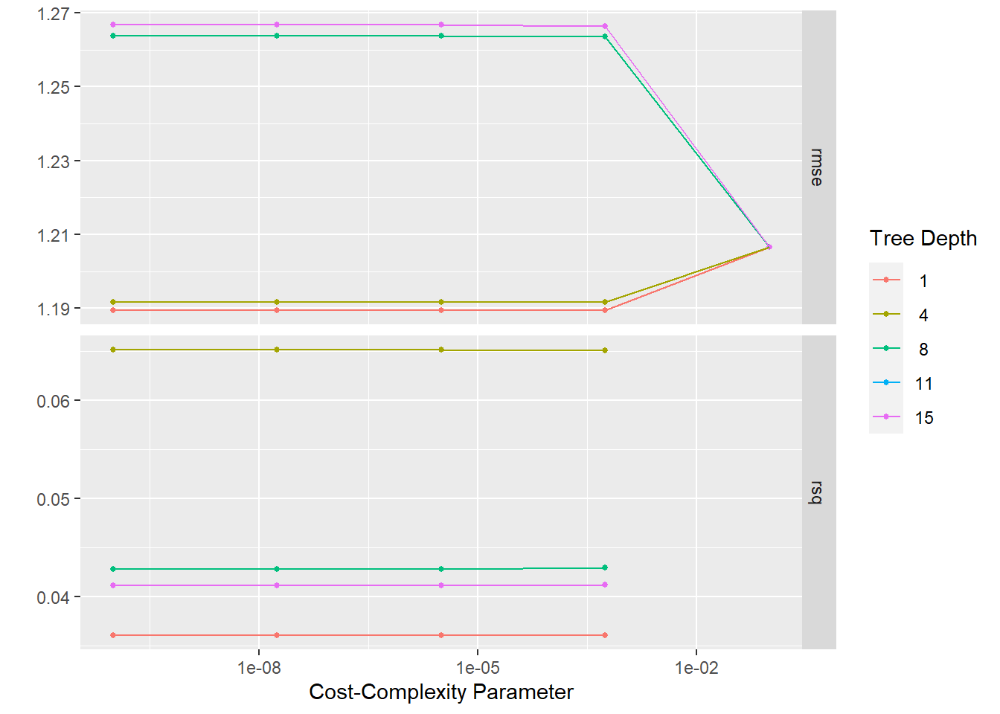{width="672"}
:::

``` {.r .cell-code}
# Selecting the best tuning parameter based on rmse
best_tree=tree_rs%>%
  select_best("rmse")
# Finalize the workflow
tree_final=
  tree_wf%>%
  finalize_workflow(best_tree)
tree_final
```

::: {.cell-output .cell-output-stdout}
```         
══ Workflow ════════════════════════════════════════════════════════════════════
Preprocessor: Recipe
Model: decision_tree()

── Preprocessor ────────────────────────────────────────────────────────────────
4 Recipe Steps

• step_dummy()
• step_mutate()
• step_ordinalscore()
• step_nzv()

── Model ───────────────────────────────────────────────────────────────────────
Decision Tree Model Specification (regression)

Main Arguments:
  cost_complexity = 1e-10
  tree_depth = 1

Computational engine: rpart 
```
:::

``` {.r .cell-code}
# Fitting training data
tree_fit=tree_final%>%
  fit(bodytemp_train)
# Predicted value
tree_predict=tree_final%>%
  fit(bodytemp_train)%>%
  predict(bodytemp_train)
tree_predict
```

::: {.cell-output .cell-output-stdout}
```         
# A tibble: 508 × 1
   .pred
   <dbl>
 1  99.2
 2  99.2
 3  98.7
 4  98.7
 5  98.7
 6  98.7
 7  98.7
 8  99.2
 9  99.2
10  99.2
# … with 498 more rows
```
:::

``` {.r .cell-code}
# Plotting the true values vs predicted values
bodytemp_train%>%
  select(BodyTemp)%>%
  bind_cols(tree_predict)%>%
  ggplot(aes(BodyTemp,.pred))+
  geom_jitter()
```

::: cell-output-display
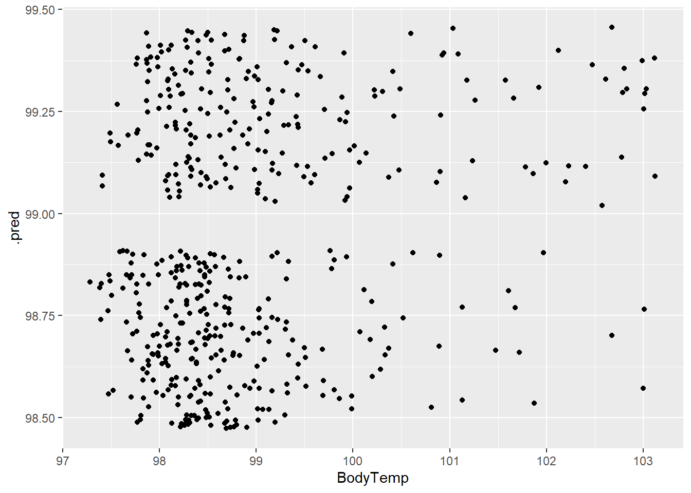{width="672"}
:::

``` {.r .cell-code}
# Plotting the residuals
# Calculate residuals
tree_resid <- bodytemp_train$BodyTemp - tree_predict
# Create a data frame with the residuals and predicted values
resid_df_tree <- data.frame(tree_resid, tree_predict)
colnames(resid_df_tree) <- c("residuals", "predicted_values")
# Draw the residual plot
ggplot(resid_df_tree, aes(x = predicted_values,y = residuals)) +
  geom_point() +
  geom_hline(yintercept = 0, linetype = "dashed") +
  labs(x="Predicted values",y="Residuals",title="Residual Plot for Decision Tree Model") 
```

::: cell-output-display
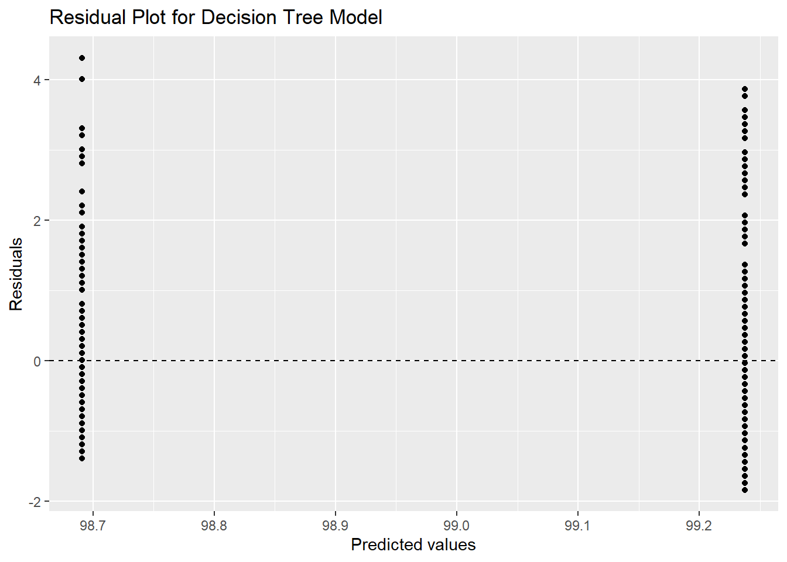{width="672"}
:::

``` {.r .cell-code}
rpart.plot(extract_fit_parsnip(tree_fit)$fit)
```

::: {.cell-output .cell-output-stderr}
```         
Warning: Cannot retrieve the data used to build the model (so cannot determine roundint and is.binary for the variables).
To silence this warning:
    Call rpart.plot with roundint=FALSE,
    or rebuild the rpart model with model=TRUE.
```
:::

::: cell-output-display
{width="672"}
:::
:::

### LASSO

::: cell
``` {.r .cell-code}
# plotting the result
glm_rs%>%
autoplot()
```

::: cell-output-display
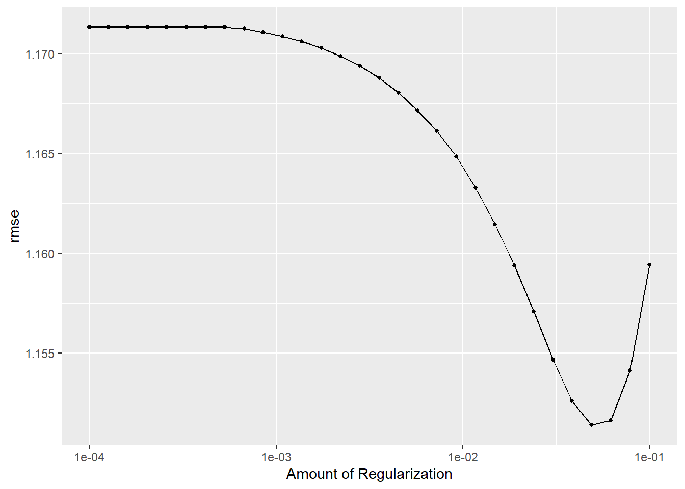{width="672"}
:::

``` {.r .cell-code}
# show the best tuning parameter
glm_rs%>%
 show_best("rmse")
```

::: {.cell-output .cell-output-stdout}
```         
# A tibble: 5 × 7
  penalty .metric .estimator  mean     n std_err .config              
    <dbl> <chr>   <chr>      <dbl> <int>   <dbl> <chr>                
1  0.0489 rmse    standard    1.15    25  0.0170 Preprocessor1_Model27
2  0.0621 rmse    standard    1.15    25  0.0170 Preprocessor1_Model28
3  0.0386 rmse    standard    1.15    25  0.0170 Preprocessor1_Model26
4  0.0788 rmse    standard    1.15    25  0.0171 Preprocessor1_Model29
5  0.0304 rmse    standard    1.15    25  0.0170 Preprocessor1_Model25
```
:::

``` {.r .cell-code}
# Selecting the best tuning parameter based on rmse
best_glm=glm_rs%>%
  select_best("rmse")
best_glm
```

::: {.cell-output .cell-output-stdout}
```         
# A tibble: 1 × 2
  penalty .config              
    <dbl> <chr>                
1  0.0489 Preprocessor1_Model27
```
:::

``` {.r .cell-code}
# Finalize the workflow
glm_final=
  glm_wf%>%
  finalize_workflow(best_glm)
# Fitting training data
glm_fit=glm_final%>%
  fit(bodytemp_train)
# Predicted value
glm_predict=glm_final%>%
  fit(bodytemp_train)%>%
  predict(bodytemp_train)
glm_predict
```

::: {.cell-output .cell-output-stdout}
```         
# A tibble: 508 × 1
   .pred
   <dbl>
 1  98.7
 2  98.8
 3  98.5
 4  98.9
 5  98.7
 6  98.7
 7  98.3
 8  99.3
 9  98.9
10  98.9
# … with 498 more rows
```
:::

``` {.r .cell-code}
# Plotting the true values vs predicted values
bodytemp_train%>%
  select(BodyTemp)%>%
  bind_cols(glm_predict)%>%
  ggplot(aes(BodyTemp,.pred))+
  geom_jitter()
```

::: cell-output-display
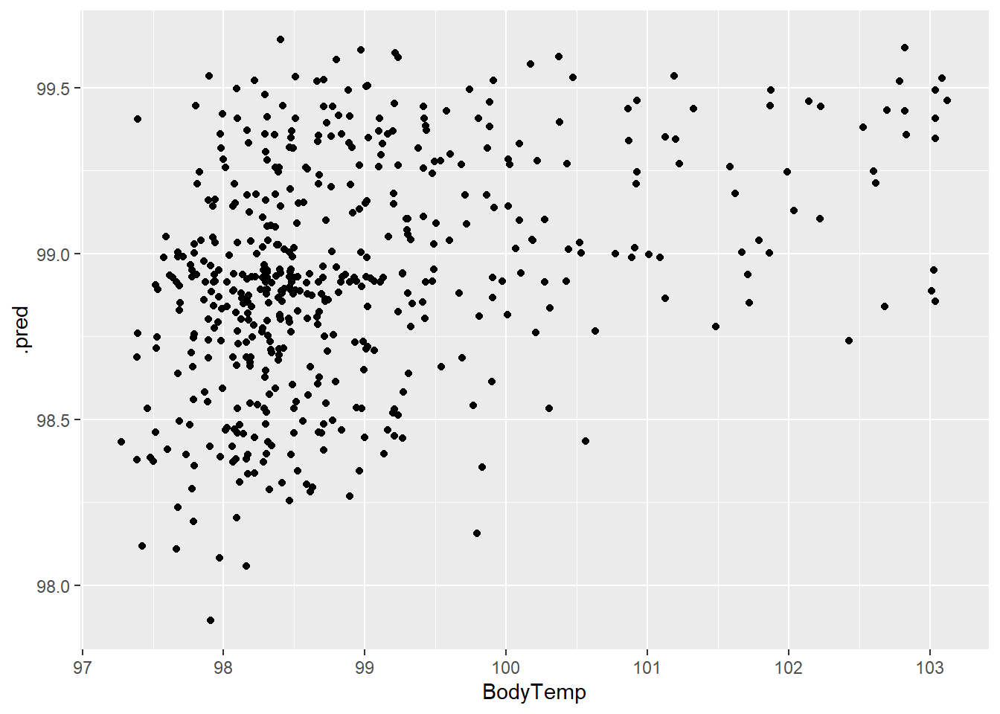{width="672"}
:::

``` {.r .cell-code}
# Residuals analysis
# Calculate residuals
glm_resid <- bodytemp_train$BodyTemp - glm_predict
# Create a data frame with the residuals and predicted values
resid_df_glm <- data.frame(glm_resid, glm_predict)
colnames(resid_df_glm) <- c("residuals", "predicted_values")
# Draw the residual plot
ggplot(resid_df_glm, aes(x = predicted_values,y = residuals)) +
  geom_point() +
  geom_hline(yintercept = 0, linetype = "dashed") +
  labs(x="Predicted values",y="Residuals",title="Residual Plot for GLM Model") 
```

::: cell-output-display
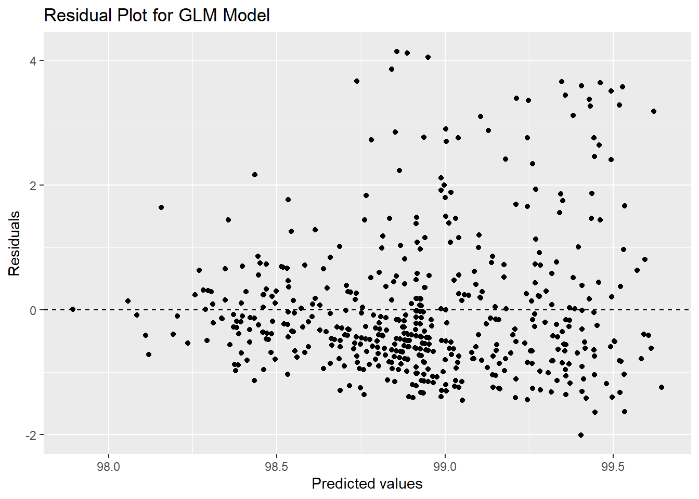{width="672"}
:::

``` {.r .cell-code}
x=glm_fit$fit$fit$fit
plot(x,"lambda")
```

::: cell-output-display
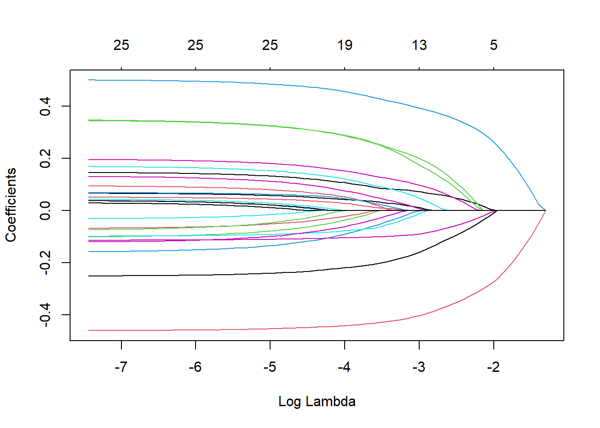{width="672"}
:::
:::

### Random forest

::: cell
``` {.r .cell-code}
# plotting the result
rf_rs%>%
autoplot()
```

::: cell-output-display
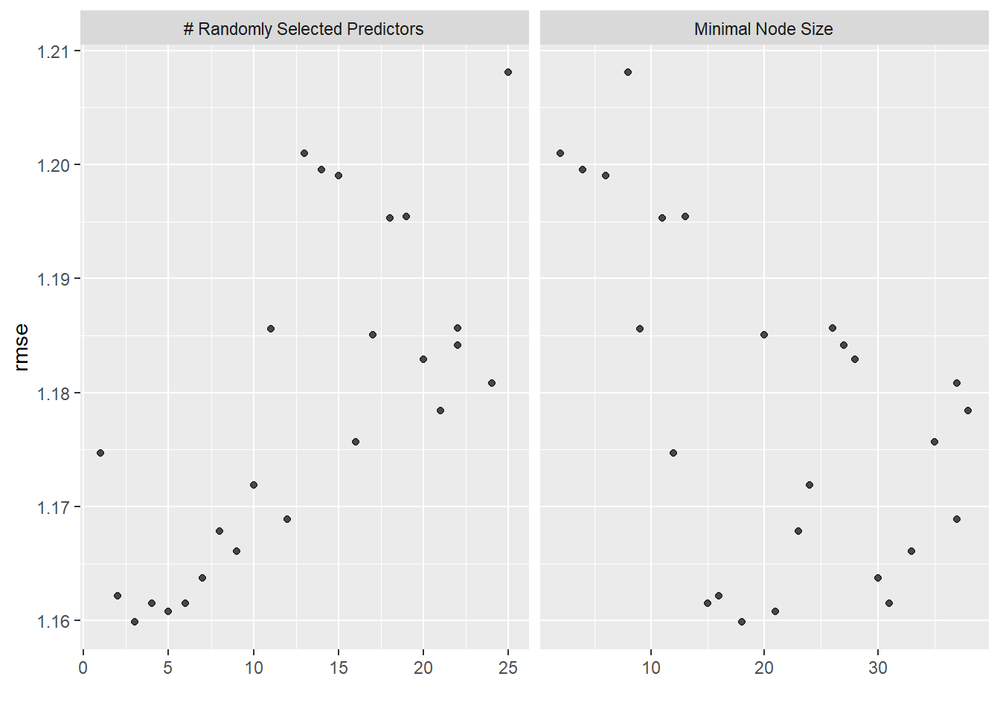{width="672"}
:::

``` {.r .cell-code}
# show the best tuning parameter
rf_rs%>%
 show_best("rmse")
```

::: {.cell-output .cell-output-stdout}
```         
# A tibble: 5 × 8
   mtry min_n .metric .estimator  mean     n std_err .config              
  <int> <int> <chr>   <chr>      <dbl> <int>   <dbl> <chr>                
1     3    18 rmse    standard    1.16    25  0.0169 Preprocessor1_Model16
2     5    21 rmse    standard    1.16    25  0.0167 Preprocessor1_Model22
3     4    15 rmse    standard    1.16    25  0.0168 Preprocessor1_Model18
4     6    31 rmse    standard    1.16    25  0.0166 Preprocessor1_Model19
5     2    16 rmse    standard    1.16    25  0.0169 Preprocessor1_Model15
```
:::

``` {.r .cell-code}
# Selecting the best tuning parameter based on rmse
best_rf=rf_rs%>%
  select_best("rmse")
best_rf
```

::: {.cell-output .cell-output-stdout}
```         
# A tibble: 1 × 3
   mtry min_n .config              
  <int> <int> <chr>                
1     3    18 Preprocessor1_Model16
```
:::

``` {.r .cell-code}
# Finalize the workflow
rf_final=
  rf_wf%>%
  finalize_workflow(best_rf)
rf_final
```

::: {.cell-output .cell-output-stdout}
```         
══ Workflow ════════════════════════════════════════════════════════════════════
Preprocessor: Recipe
Model: rand_forest()

── Preprocessor ────────────────────────────────────────────────────────────────
4 Recipe Steps

• step_dummy()
• step_mutate()
• step_ordinalscore()
• step_nzv()

── Model ───────────────────────────────────────────────────────────────────────
Random Forest Model Specification (regression)

Main Arguments:
  mtry = 3
  trees = 1000
  min_n = 18

Engine-Specific Arguments:
  num.threads = cores

Computational engine: ranger 
```
:::

``` {.r .cell-code}
# Fitting training data
rf_fit=rf_final%>%
  fit(bodytemp_train)
# Predicted value
rf_predict=glm_final%>%
  fit(bodytemp_train)%>%
  predict(bodytemp_train)
rf_predict
```

::: {.cell-output .cell-output-stdout}
```         
# A tibble: 508 × 1
   .pred
   <dbl>
 1  98.7
 2  98.8
 3  98.5
 4  98.9
 5  98.7
 6  98.7
 7  98.3
 8  99.3
 9  98.9
10  98.9
# … with 498 more rows
```
:::

``` {.r .cell-code}
# Plotting the true values vs predicted values
bodytemp_train%>%
  select(BodyTemp)%>%
  bind_cols(rf_predict)%>%
  ggplot(aes(BodyTemp,.pred))+
  geom_jitter()
```

::: cell-output-display
{width="672"}
:::

``` {.r .cell-code}
# Plotting the residuals
# Calculate residuals
rf_resid <- bodytemp_train$BodyTemp - rf_predict
# Create a data frame with the residuals and predicted values
resid_df_rf <- data.frame(rf_resid, rf_predict)
colnames(resid_df_rf) <- c("residuals", "predicted_values")
# Draw the residual plot
ggplot(resid_df_rf, aes(x = predicted_values,y = residuals)) +
  geom_point() +
  geom_hline(yintercept = 0, linetype = "dashed") +
  labs(x="Predicted values",y="Residuals",title="Residual Plot for Random Forest Model")
```

::: cell-output-display
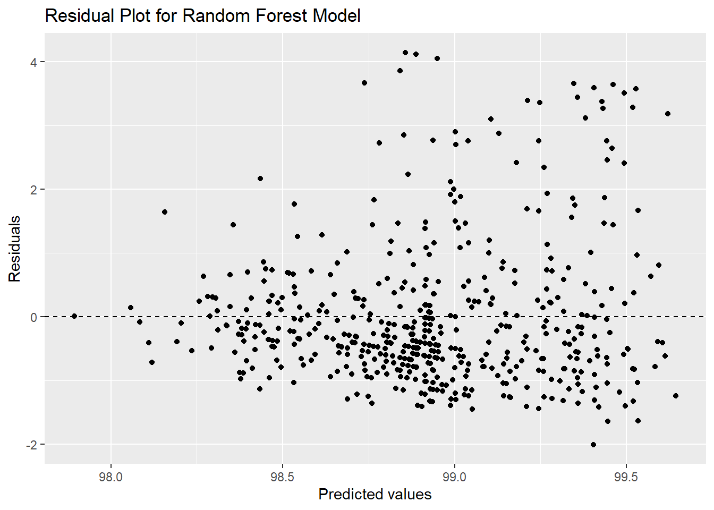{width="672"}
:::
:::

## Compare three models with the null model

::: cell
``` {.r .cell-code}
tree_metrics=tree_rs%>%
 show_best("rmse")%>%
  filter(.config=="Preprocessor1_Model01")
glm_metrics=glm_rs%>%
 show_best("rmse")%>%
  filter(.config=="Preprocessor1_Model27")
rf_metrics=rf_rs%>%
 show_best("rmse")%>%
  filter(.config=="Preprocessor1_Model22")
null_rs%>%
  collect_metrics()%>%
  mutate(model="Null")%>%
  bind_rows(tree_metrics%>%
              mutate(model="tree"),
            glm_metrics%>%
              mutate(model="LASSO"),
            rf_metrics%>%
              mutate(model="random forest")
    
  )%>%
  select(c(1:6),model)%>%
  kable()
```

::: cell-output-display
| .metric | .estimator |     mean |   n |   std_err | .config               | model         |
|:--------|:-----------|---------:|----:|----------:|:----------------------|:--------------|
| rmse    | standard   | 1.206661 |  25 | 0.0176723 | Preprocessor1_Model1  | Null          |
| rmse    | standard   | 1.189406 |  25 | 0.0180607 | Preprocessor1_Model01 | tree          |
| rmse    | standard   | 1.151382 |  25 | 0.0169964 | Preprocessor1_Model27 | LASSO         |
| rmse    | standard   | 1.160807 |  25 | 0.0167077 | Preprocessor1_Model22 | random forest |
:::
:::

## Final model selection

### After comparing four models, LASSO model is the best model since it has the lowest rmse. Although the standard error is a bit higher than that of random forest.

::: cell
``` {.r .cell-code}
glm_fit_final=glm_final%>%
  last_fit(bodytemp_split)
glm_fit_final%>%
  collect_metrics()
```

::: {.cell-output .cell-output-stdout}
```         
# A tibble: 2 × 4
  .metric .estimator .estimate .config             
  <chr>   <chr>          <dbl> <chr>               
1 rmse    standard      1.16   Preprocessor1_Model1
2 rsq     standard      0.0312 Preprocessor1_Model1
```
:::

``` {.r .cell-code}
glm_predict_final=glm_fit_final%>%
  collect_predictions()
glm_fit_final%>%
  extract_fit_engine()%>%
  vip()
```

::: cell-output-display
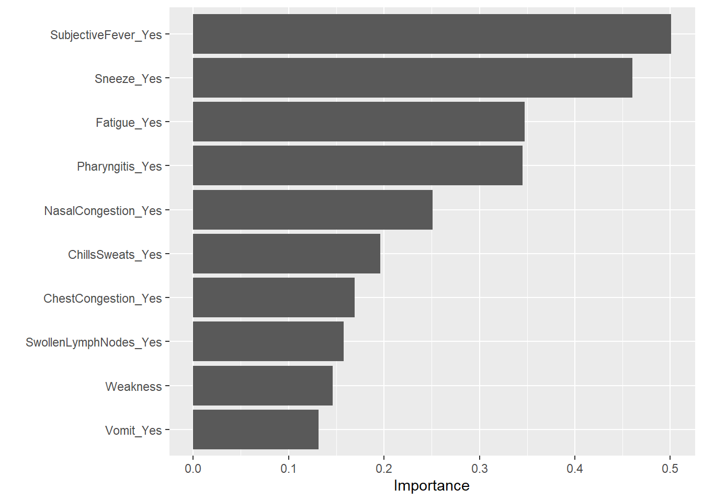{width="672"}
:::

``` {.r .cell-code}
# Plotting the true values vs predicted values
glm_predict_final%>%
  ggplot(aes(BodyTemp,.pred))+
  geom_jitter()+
  geom_smooth()
```

::: {.cell-output .cell-output-stderr}
```         
`geom_smooth()` using method = 'loess' and formula = 'y ~ x'
```
:::

::: cell-output-display
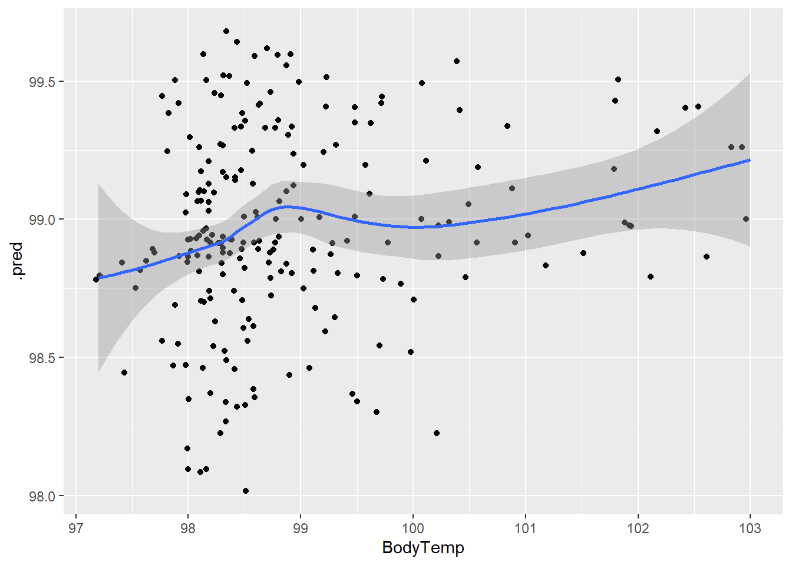{width="672"}
:::

``` {.r .cell-code}
## Plot residuals
final_resid=glm_predict_final$BodyTemp-glm_predict_final$.pred
final_resid_df=data.frame(final_resid,glm_predict_final$.pred)
colnames(final_resid_df)=c("residuals", "predicted_values")
ggplot(final_resid_df,aes(predicted_values,residuals))+
  geom_point()+
  geom_hline(yintercept=0,linetype="dashed")+
   labs(x="Predicted values",y="Residuals",title="Residual Plot for Final Model LASSO")
```

::: cell-output-display
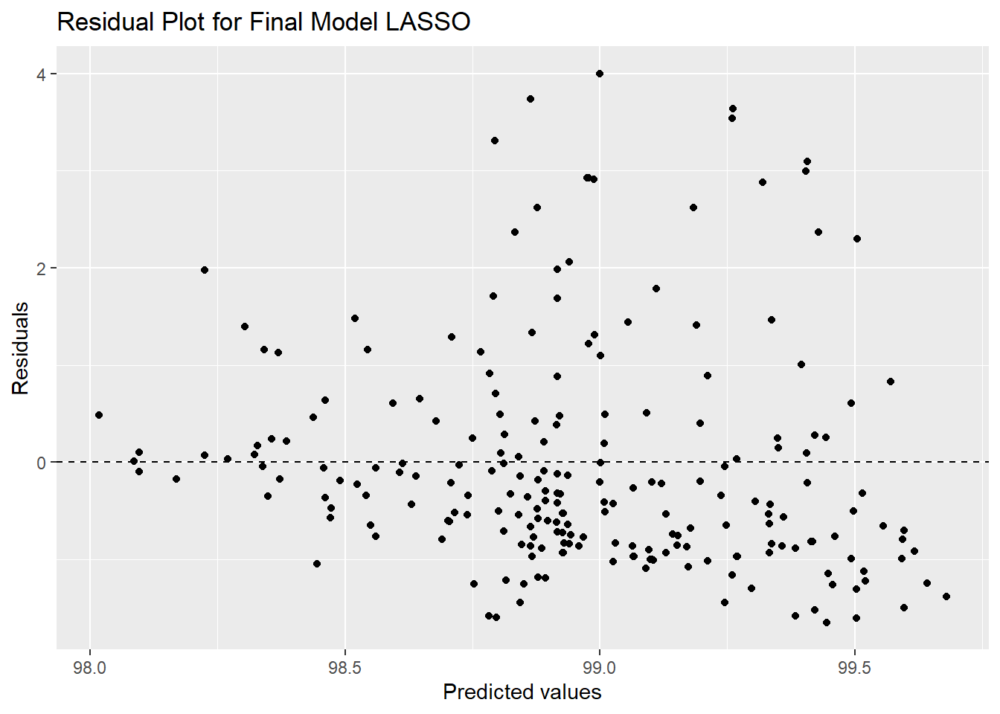{width="672"}
:::
:::

## In conclusion, the best model LASSO has rmse of 1.155 when it fits testing data. The residuals seems to be randomly distributed on the residual plot
